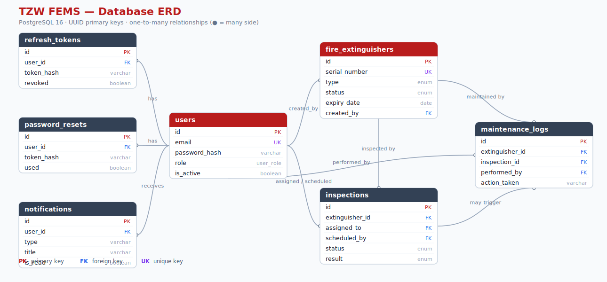
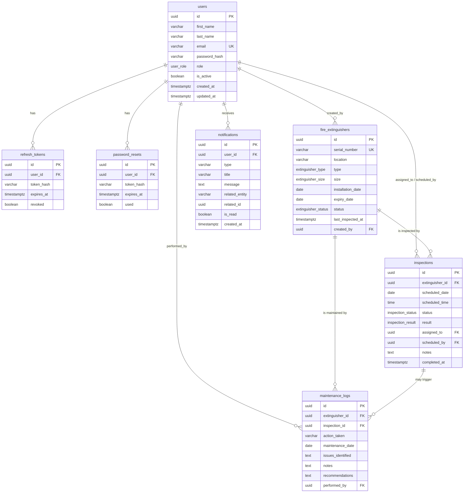

# Entity Relationship Diagram & Database Schema

Database: **PostgreSQL 16**. UUID primary keys (`gen_random_uuid()`), `TIMESTAMPTZ` timestamps, enum types for controlled vocabularies, and `updated_at` triggers.

> 🖼️ **Rendered diagram:** [`diagrams/database-erd.svg`](diagrams/database-erd.svg) — a standalone vector image (open in any browser, or drop straight into slides/report). Regenerate it any time with `node docs/diagrams/generate-erd.js`.

## ERD (Mermaid)

## Enum types

| Enum                  | Values |
|-----------------------|--------|
| `user_role`           | `admin`, `inspector`, `user` |
| `extinguisher_type`   | `water`, `co2`, `foam`, `dry_chemical` |
| `extinguisher_size`   | `2.5lb`, `5lb`, `9lb`, `12lb` |
| `extinguisher_status` | `active`, `maintenance`, `expired`, `decommissioned` |
| `inspection_status`   | `pending`, `completed`, `overdue`, `cancelled` |
| `inspection_result`   | `pass`, `fail`, `needs_maintenance` |

## Tables & relationships

| Table | Key relationships | Notable constraints / indexes |
|-------|-------------------|-------------------------------|
| `users` | parent of tokens, extinguishers, inspections, maintenance, notifications | `UNIQUE(email)`, index on `lower(email)`, `role` |
| `refresh_tokens` | `user_id → users` (CASCADE) | index `token_hash`; enables logout/revocation |
| `password_resets` | `user_id → users` (CASCADE) | one-time tokens, `expires_at`, `used` |
| `fire_extinguishers` | `created_by → users` (SET NULL) | `UNIQUE(serial_number)`, `CHECK(expiry_date >= installation_date)`, indexes on `status`, `type`, `expiry_date`, `location` |
| `inspections` | `extinguisher_id → fire_extinguishers` (CASCADE); `assigned_to`, `scheduled_by → users` (SET NULL) | indexes on `extinguisher_id`, `status`, `scheduled_date`, `assigned_to` |
| `maintenance_logs` | `extinguisher_id → fire_extinguishers` (CASCADE); `inspection_id → inspections` (SET NULL); `performed_by → users` | indexes on `extinguisher_id`, `maintenance_date` |
| `notifications` | `user_id → users` (CASCADE; NULL = broadcast) | indexes on `user_id`, `is_read`, `created_at` |

## Referential actions

- Deleting a **user** cascades their tokens/notifications but **nulls** their references on extinguishers/inspections/maintenance (preserve audit history).
- Deleting an **extinguisher** cascades its inspections and maintenance logs.
- Deleting an **inspection** nulls the `inspection_id` on related maintenance logs.

The authoritative schema is the set of SQL files in [`/db/migrations`](../db/migrations).
